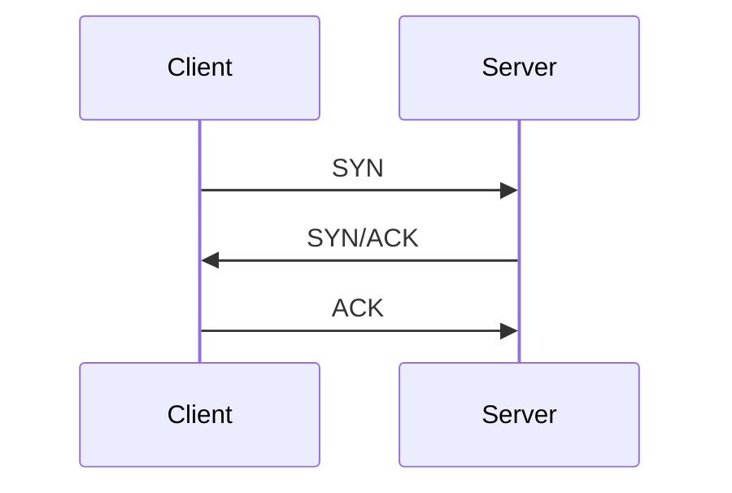
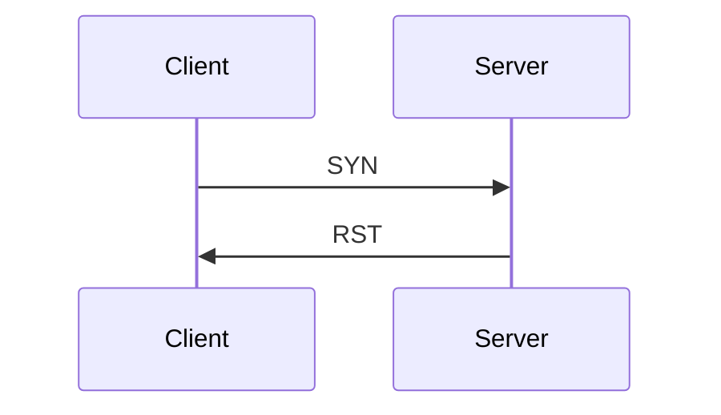

[Nmap](https://www.kali.org/tools/nmap/) is applicable for network exploration or security auditing. It supports ping scanning (determining which hosts are up), many port scanning techniques, version detection (determining service protocols and application versions listening behind ports), and **TCP/IP** fingerprinting (remote host OS or device identification). Nmap also offers flexible target and port specification, decoy/stealth scanning, sunRPC scanning, and more. Most Unix and Windows platforms are supported in GUI and command line modes. Several popular handheld devices, including the Sharp Zaurus and the iPAQ, are also supported.

There are three basic scan types when port scanning with Nmap. These are:

- TCP Connect Scans (```-sT```)
- SYN "Half-open" Scans (```-sS```)
- UDP Scans (```-sU```)

There are several less common port scan types, some of which we will also cover (albeit in less detail). These are:

- TCP Null Scans (```-sN```)
- TCP FIN Scans (```-sF```)
- TCP Xmas Scans (```-sX```)

You must be comfortable with the **TCP** three-way handshake to understand **TCP** Connect scans (```-sT```). First, the connecting terminal (our attacking machine, in this instance) sends a **TCP** request to the target server using the **SYN** flag set. The server then acknowledges this packet with a **TCP** response containing the **SYN** flag and the **ACK** flag. Finally, our terminal completes the handshake by sending a **TCP** request with the **ACK** flag set.




As the name suggests, a **TCP** Connect scan works by performing the three-way handshake with each target port in turn. In other words, ```Nmap``` tries to connect to each specified **TCP** port and determines whether the service is open based on the response it receives.

For example, if a port is closed, [RFC 9293](https://datatracker.ietf.org/doc/html/rfc9293) states that: 

"... _If the connection does not exist (CLOSED), a reset is sent in response to any incoming segment except another reset. A **SYN** segment that does not match an existing connection is rejected by this means._"

In other words, if ```Nmap``` sends a **TCP** request with the **SYN** flag set to a **closed port**, the target server will respond with a **TCP** packet with the **RST** (Reset) flag set. This response allows ```Nmap``` to establish that the port is closed.



If the request is sent to an open port, the target will respond with a **TCP** packet with the **SYN/ACK** flags set. ```Nmap``` then marks this port as open (and completes the handshake by returning a **TCP** packet with the **ACK** flag set).

This is all well and good. However, there is a third possibility. What if the port is open but hidden behind a firewall?

Many firewalls are configured to drop incoming packets. ```Nmap``` sends a **TCP** **SYN** request but receives nothing back. This indicates that a firewall is protecting the port, which is thus considered **filtered**.

That said, it is very easy to configure a firewall to respond with a **RST** **TCP** packet. For example, in IPtables for Linux, a simple version of the command would be as follows:

```bash
iptables -I INPUT -p tcp --dport <port> -j REJECT --reject-with tcp-reset
```

This can make it extremely difficult (if not impossible) to get an accurate reading of the target(s).

Examples:
