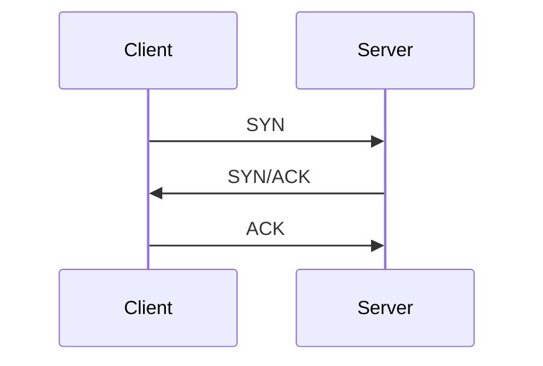
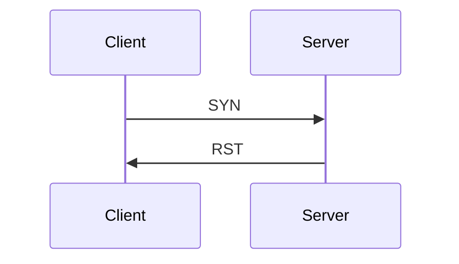

# Nmap

[Nmap](https://www.kali.org/tools/nmap/) is applicable for network exploration or security auditing. It supports ping scanning (determining which hosts are up), many port scanning techniques, version detection (determining service protocols and application versions listening behind ports), and **TCP/IP** fingerprinting (remote host OS or device identification). Nmap also offers flexible target and port specification, decoy/stealth scanning, sunRPC scanning, and more. Most Unix and Windows platforms are supported in GUI and command line modes. Several popular handheld devices, including the Sharp Zaurus and the iPAQ, are also supported.

There are three basic scan types when port scanning with Nmap. These are:

- TCP Connect Scans (```-sT```)
- SYN "Half-open" Scans (```-sS```)
- UDP Scans (```-sU```)

There are several less common port scan types, some of which we will also cover (albeit in less detail). These are:

- TCP Null Scans (```-sN```)
- TCP FIN Scans (```-sF```)
- TCP Xmas Scans (```-sX```)

## TCP Connect Scans

You must be comfortable with the **TCP** three-way handshake to understand **TCP** Connect scans (```-sT```). First, the connecting terminal (our attacking machine, in this instance) sends a **TCP** request to the target server using the **SYN** flag set. The server then acknowledges this packet with a **TCP** response containing the **SYN** flag and the **ACK** flag. Finally, our terminal completes the handshake by sending a **TCP** request with the **ACK** flag set.




As the name suggests, a **TCP** Connect scan works by performing the three-way handshake with each target port in turn. In other words, ```Nmap``` tries to connect to each specified **TCP** port and determines whether the service is open based on the response it receives.

For example, if a port is closed, [RFC 9293](https://datatracker.ietf.org/doc/html/rfc9293) states that: 

"... _If the connection does not exist (CLOSED), a reset is sent in response to any incoming segment except another reset. A **SYN** segment that does not match an existing connection is rejected by this means._"

In other words, if ```Nmap``` sends a **TCP** request with the **SYN** flag set to a **closed port**, the target server will respond with a **TCP** packet with the **RST** (Reset) flag set. This response allows ```Nmap``` to establish that the port is closed.



If the request is sent to an open port, the target will respond with a **TCP** packet with the **SYN/ACK** flags set. ```Nmap``` then marks this port as open (and completes the handshake by returning a **TCP** packet with the **ACK** flag set).

This is all well and good. However, there is a third possibility. What if the port is open but hidden behind a firewall?

Many firewalls are configured to drop incoming packets. ```Nmap``` sends a **TCP** **SYN** request but receives nothing back. This indicates that a firewall protects the port, thus considered **filtered**.

That said, it is elementary to configure a firewall to respond with a **RST** **TCP** packet. For example, in IPtables for Linux, a simple version of the command would be as follows:

```bash
iptables -I INPUT -p tcp --dport <port> -j REJECT --reject-with tcp-reset
```

This can make it extremely difficult (if possible) to get an accurate reading of the target(s).


## SYN Scans

As with **TCP** scans, SYN scans (```-sS```) are used to scan the **TCP** port range of a target or targets; however, the two scan types work slightly differently. **SYN** scans are sometimes called "Half-open" or "Stealth" scans.

Where **TCP scans** perform a full three-way handshake with the target, **SYN** scans send back an **RST TCP** packet after receiving an **SYN/ACK** from the server (this prevents the server from repeatedly trying to make the request). In other words, the sequence for scanning an open port looks like this:


This has a variety of advantages:

- It can bypass older Intrusion Detection Systems(IDS), which require a full three-way handshake. This is often no longer the case with modern IDS solutions. For this reason, **SYN scans** are still frequently referred to as "stealth" scans.
- Applications listening on open ports often do not log **SYN** scans, as standard practice is to log a connection once it's been fully established. Again, this plays into the idea of **SYN** scans being stealthy.
- **SYN** scans are significantly faster than a standard **TCP Connect** scan because they do not require completing (and disconnecting from) a three-way handshake for every port.

There are, however, a couple of disadvantages to **SYN** scans, namely:

- They require sudo permissions to work correctly in Linux. This is because **SYN** scans require the ability to create raw packets (as opposed to the entire **TCP** handshake), which is a privilege only the root user has by default.
- **SYN** scans sometimes bring down unstable services, which could prove problematic if a client has provided a production environment for the test.

For this reason, **SYN** scans are the default scans used by ```Nmap``` if run **with sudo permissions**. If run **without sudo permissions**, ```Nmap``` defaults to the **TCP Connect** scan.

When using an **SYN** scan to identify closed and filtered ports, the same rules apply as with a **TCP Connect** scan.

The server responds with an **RST TCP** packet if a port is closed. If a firewall filters the port, the **TCP SYN** packet is either dropped or spoofed with a **TCP RST**. The two scans are identical, but the big difference is how they handle open ports.


## UDP Scans

**Unlike TCP, UDP connections are stateless**. This means that rather than initiating a connection with a back-and-forth "handshake," **UDP** connections rely on sending packets to a target port and hoping they make it. This makes **UDP** superb for connections that depend on speed over quality (e.g., video sharing), but the lack of acknowledgment makes **UDP** significantly more difficult (and much slower) to scan. The switch for a ```Nmap``` **UDP scan** is (```-sU```)

No response should occur when a packet is sent to an **open UDP** port. When this happens, ```Nmap``` refers to the port as ```open|filtered```. In other words, it suspects the port is open but could be firewalled. The port is marked as open if it gets a **UDP** response (which is very unusual). More commonly, there is no response, in which case the request is sent twice as a double-check. If there is no response, the port is marked open|filtered, and ```Nmap``` moves on.

When a packet is sent to a **closed UDP** port, the target should respond with an ICMP (ping) packet containing a message that the port is unreachable. This identifies closed ports, which ```Nmap``` marks as such and moves on.

Due to this difficulty in identifying whether a **UDP port** is open, **UDP scans** tend to be incredibly slow compared to the various **TCP scans** (in the region of 20 minutes to scan the first 1000 ports, with a good connection). For this reason, it's usually good practice to run a Nmap scan with ```--top-ports <number>``` enabled.

When scanning **UDP** ports, ```Nmap``` usually sends empty requests - just raw **UDP** packets. That said, for ports usually occupied by well-known services, it will instead send a protocol-specific payload, which is more likely to elicit a response from which a more accurate result can be drawn.

Examples:

It will scan the top 20 most commonly used UDP ports, resulting in a much more acceptable scan time.

```bash
nmap -sU --top-ports 20 <target>
```


