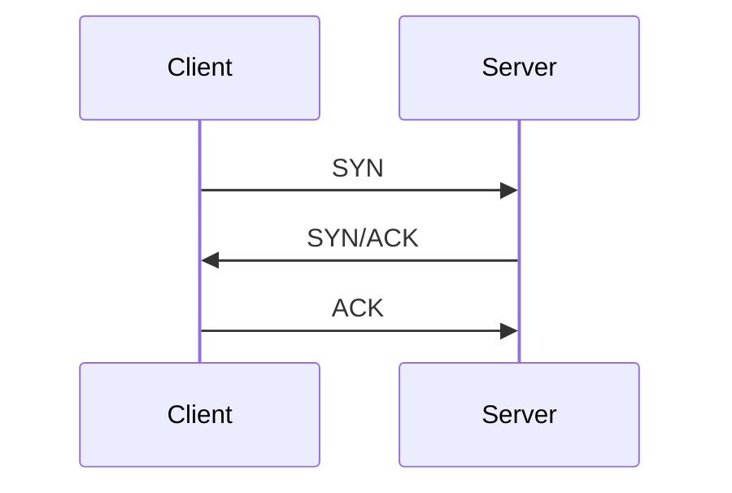
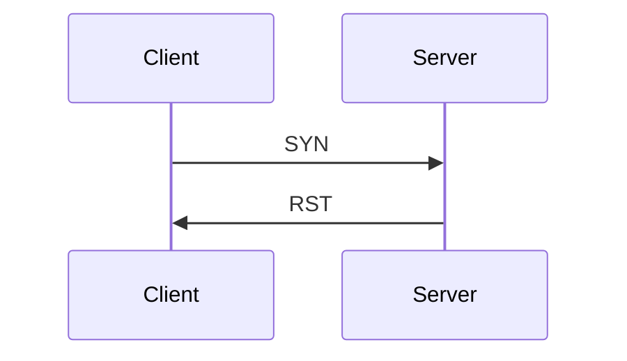

# Nmap

[Nmap](https://www.kali.org/tools/nmap/) is applicable for network exploration or security auditing. It supports ping scanning (determining which hosts are up), many port scanning techniques, version detection (determining service protocols and application versions listening behind ports), and **TCP/IP** fingerprinting (remote host OS or device identification). Nmap also offers flexible target and port specification, decoy/stealth scanning, sunRPC scanning, and more. Most Unix and Windows platforms are supported in GUI and command line modes. Several popular handheld devices, including the Sharp Zaurus and the iPAQ, are also supported.

[Nmap Book](https://nmap.org/book/)

There are three basic scan types when port scanning with Nmap. These are:

- TCP Connect Scans (```-sT```)
- SYN "Half-open" Scans (```-sS```)
- UDP Scans (```-sU```)

There are several less common port scan types, some of which we will also cover (albeit in less detail). These are:

- TCP Null Scans (```-sN```)
- TCP FIN Scans (```-sF```)
- TCP Xmas Scans (```-sX```)

## TCP Connect Scans

You must be comfortable with the **TCP** three-way handshake to understand **TCP** Connect scans (```-sT```). First, the connecting terminal (our attacking machine, in this instance) sends a **TCP** request to the target server using the **SYN** flag set. The server then acknowledges this packet with a **TCP** response containing the **SYN** flag and the **ACK** flag. Finally, our terminal completes the handshake by sending a **TCP** request with the **ACK** flag set.




As the name suggests, a **TCP** Connect scan works by performing the three-way handshake with each target port in turn. In other words, ```Nmap``` tries to connect to each specified **TCP** port and determines whether the service is open based on the response it receives.

For example, if a port is closed, [RFC 9293](https://datatracker.ietf.org/doc/html/rfc9293) states that: 

"... _If the connection does not exist (CLOSED), a reset is sent in response to any incoming segment except another reset. A **SYN** segment that does not match an existing connection is rejected by this means._"

In other words, if ```Nmap``` sends a **TCP** request with the **SYN** flag set to a **closed port**, the target server will respond with a **TCP** packet with the **RST** (Reset) flag set. This response allows ```Nmap``` to establish that the port is closed.



If the request is sent to an open port, the target will respond with a **TCP** packet with the **SYN/ACK** flags set. ```Nmap``` then marks this port as open (and completes the handshake by returning a **TCP** packet with the **ACK** flag set).

This is all well and good. However, there is a third possibility. What if the port is open but hidden behind a firewall?

Many firewalls are configured to drop incoming packets. ```Nmap``` sends a **TCP** **SYN** request but receives nothing back. This indicates that a firewall protects the port, thus considered **filtered**.

That said, it is elementary to configure a firewall to respond with a **RST** **TCP** packet. For example, in IPtables for Linux, a simple version of the command would be as follows:

```bash
iptables -I INPUT -p tcp --dport <port> -j REJECT --reject-with tcp-reset
```

This can make it extremely difficult (if possible) to get an accurate reading of the target(s).


## SYN Scans

As with **TCP** scans, SYN scans (```-sS```) are used to scan the **TCP** port range of a target or targets; however, the two scan types work slightly differently. **SYN** scans are sometimes called "Half-open" or "Stealth" scans.

Where **TCP scans** perform a full three-way handshake with the target, **SYN** scans send back an **RST TCP** packet after receiving an **SYN/ACK** from the server (this prevents the server from repeatedly trying to make the request). In other words, the sequence for scanning an open port looks like this:


This has a variety of advantages:

- It can bypass older Intrusion Detection Systems(IDS), which require a full three-way handshake. This is often no longer the case with modern IDS solutions. For this reason, **SYN scans** are still frequently referred to as "stealth" scans.
- Applications listening on open ports often do not log **SYN** scans, as standard practice is to log a connection once it's been fully established. Again, this plays into the idea of **SYN** scans being stealthy.
- **SYN** scans are significantly faster than a standard **TCP Connect** scan because they do not require completing (and disconnecting from) a three-way handshake for every port.

There are, however, a couple of disadvantages to **SYN** scans, namely:

- They require sudo permissions to work correctly in Linux. This is because **SYN** scans require the ability to create raw packets (as opposed to the entire **TCP** handshake), which is a privilege only the root user has by default.
- **SYN** scans sometimes bring down unstable services, which could prove problematic if a client has provided a production environment for the test.

For this reason, **SYN** scans are the default scans used by ```Nmap``` if run **with sudo permissions**. If run **without sudo permissions**, ```Nmap``` defaults to the **TCP Connect** scan.

When using an **SYN** scan to identify closed and filtered ports, the same rules apply as with a **TCP Connect** scan.

The server responds with an **RST TCP** packet if a port is closed. If a firewall filters the port, the **TCP SYN** packet is either dropped or spoofed with a **TCP RST**. The two scans are identical, but the big difference is how they handle open ports.


## UDP Scans

**Unlike TCP, UDP connections are stateless**. This means that rather than initiating a connection with a back-and-forth "handshake," **UDP** connections rely on sending packets to a target port and hoping they make it. This makes **UDP** superb for connections that depend on speed over quality (e.g., video sharing), but the lack of acknowledgment makes **UDP** significantly more difficult (and much slower) to scan. The switch for a ```Nmap``` **UDP scan** is (```-sU```)

No response should occur when a packet is sent to an **open UDP** port. When this happens, ```Nmap``` refers to the port as ```open|filtered```. In other words, it suspects the port is open but could be firewalled. The port is marked as open if it gets a **UDP** response (which is very unusual). More commonly, there is no response, in which case the request is sent twice as a double-check. If there is no response, the port is marked open|filtered, and ```Nmap``` moves on.

When a packet is sent to a **closed UDP** port, the target should respond with an ICMP (ping) packet containing a message that the port is unreachable. This identifies closed ports, which ```Nmap``` marks as such and moves on.

Due to this difficulty in identifying whether a **UDP port** is open, **UDP scans** tend to be incredibly slow compared to the various **TCP scans** (in the region of 20 minutes to scan the first 1000 ports, with a good connection). For this reason, it's usually good practice to run a Nmap scan with ```--top-ports <number>``` enabled.

When scanning **UDP** ports, ```Nmap``` usually sends empty requests - just raw **UDP** packets. That said, for ports usually occupied by well-known services, it will instead send a protocol-specific payload, which is more likely to elicit a response from which a more accurate result can be drawn.

Examples:

It will scan the top 20 most commonly used UDP ports, resulting in a much more acceptable scan time.

```bash
nmap -sU --top-ports 20 <target>
```


## NULL, FIN, and Xmas

**NULL**, **FIN**, and **Xmas** **TCP port** scans are less commonly used. All three are interlinked and are mainly used as they tend to be even stealthier, relatively speaking, than a **SYN** "stealth" scan. Beginning with NULL scans:

- **NULL** scans (```-sN```) are when the **TCP** request is sent with no flags set. Per the RFC, the target host should respond with a **RST** if the port is closed.


- **FIN scans** (```-sF```) work almost identically. However, instead of sending an empty packet, a request with the **FIN** flag (usually used to close an active connection gracefully) is sent. Once again, Nmap expects an **RST** if the port is closed.


- **Xmas scans** (```-sX```) send a malformed **TCP** packet and expect an **RST** response for closed ports.


The expected response for open ports with these scans is identical and similar to that of a **UDP scan**. If the port is open, there is no response to the malformed packet. Unfortunately (as with open UDP ports), that is also expected if a firewall protects the port, so **NULL**, **FIN**, and **Xmas** scans will only ever identify ports as being **open|filtered**, **closed**, or **filtered**. If a port is identified as filtered with one of these scans, it is usually because the target has responded with an ICMP unreachable packet.

It's also worth noting that while RFC 793 mandates that network hosts respond to malformed packets with an **RST TCP** packet for closed ports and don't respond for open ports, this is only sometimes the practice case. In particular, Microsoft Windows (and many Cisco network devices) are known to respond with an **RST** to any malformed **TCP** packet, regardless of whether the port is open. This results in all ports showing up as being closed.

That said, the goal here is, of course, firewall evasion. Many firewalls are configured to drop incoming **TCP** packets to blocked ports with the **SYN** flag set (thus blocking new connection initiation requests). We effectively bypass this kind of firewall by sending requests that do not contain the **SYN** flag. While this is good in theory, most modern **IDS** solutions are savvy to these scan types, so don't rely on them to be 100% effective when dealing with modern systems.


## ICMP Network Scanning

On the first connection to a target network in a black box assignment, our first objective is to obtain a "map" of the network structure - that is, we want to see which IP addresses contain active hosts and which do not.

One way to do this is to use ```Nmap``` to perform a so-called "ping sweep." This is exactly as the name suggests: Nmap sends an **ICMP** packet to each possible IP address for the specified network. When it receives a response, it marks the IP address that responded as alive. This is only sometimes accurate, for reasons we'll see later. However, it can provide a baseline and thus is worth covering.

To perform a ping sweep, we use the ```-sn``` switch in conjunction with IP ranges, which can be specified with either a hyphen (-) or CIDR notation.

The ```-sn``` switch tells ```Nmap``` not to scan any ports, forcing it to rely primarily on **ICMP** echo packets (or ARP requests on a local network, if run with sudo or directly as the root user) to identify targets. In addition to the **ICMP** echo requests, the ```-sn``` switch will also cause ```Nmap``` to send a **TCP** **SYN** packet to port **443** of the target and a **TCP** **ACK** (or **TCP** **SYN** if not run as root) packet to port **80** of the target.

Examples:

```bash
nmap -sn 192.168.0.1-254
nmap -sn 192.168.0.0/24
```

## NSE Scripts

The **N**map **S**cripting **E**ngine (**NSE**) is a compelling addition to ```Nmap```, considerably extending its functionality. **NSE Scripts** are written in the Lua programming language and can be used to do various things, from scanning for vulnerabilities to automating exploits. The **NSE** is handy for surveillance. However, it is well worth considering how extensive the script library is.

There are many categories available. Some valuable categories include:

- ```safe```:- Won't affect the target
- ```intrusive```:- Not safe: likely to affect the target
- ```vuln```:- Scan for vulnerabilities
- ```exploit```:- Attempt to exploit a vulnerability
- ```auth```:- Attempt to bypass authentication for running services (e.g., Log into an FTP server anonymously)
- ```brute```:- Attempt to brute-force credentials for running services
- ```discovery```:- Attempt to query running services for further information about the network (e.g., query an SNMP server).

A more exhaustive list can be found [here](https://nmap.org/book/nse-usage.html).

We would use ```--script=<script-name>```, e.g. ```--script=http-fileupload-exploiter``` to run a specific script.

Multiple scripts can be run simultaneously by separating them by a comma. For example: ``` --script=smb-enum-users,smb-enum-shares```.

Some scripts require arguments (for example, credentials if they're exploiting an authenticated vulnerability). These can be given with the ```--script-args``` Nmap switch. 

```Nmap``` stores its scripts on Linux at ```/usr/share/nmap/scripts```. All the **NSE scripts** are stored in this directory by default. This is where Nmap looks for scripts when you specify them.

The ```ls``` command makes it quite simple to search for scripts. For example, we could get the same results as in the previous screenshot by using ```ls —l /usr/share/nmap/scripts/*ftp*```.

Examples:

An ```http-put``` script (used to upload files using the PUT method). It takes two arguments: the URL to upload the file and its location on disk. Note that the arguments are separated by commas and connected to the corresponding script with periods (i.e., ```<script-name>.<argument>```). A complete list of scripts and their corresponding arguments (along with example use cases) can be found [here](https://nmap.org/nsedoc/).

```bash
nmap -p 80 --script http-put --script-args http-put.url='/dav/shell.php',http-put.file='./shell.php'
```

### Installing New Scripts

The [Nmap website](https://nmap.org/nsedoc/) contains a list of all official scripts. To install the scripts manually by downloading the script from Nmap ```sudo wget -O /usr/share/nmap/scripts/<script-name>.nse https://svn.nmap.org/nmap/scripts/<script-name>.nse```.  This must then be followed up with ```nmap --script-updatedb```, which updates the ```script.db``` file to contain the newly downloaded script.


## Firewall Evasion

We have already seen some techniques for bypassing firewalls (think stealth scans, **NULL**, **FIN**, and **Xmas** scans); however, there is another prevalent firewall configuration that we must know how to bypass.

Your typical Windows host will block all **ICMP** packets with its default firewall. This presents a problem: not only do we often use ping to establish a target's activity manually, but **Nmap** does the same thing by default. This means that **Nmap** will register a host with this firewall configuration dead and not bother scanning it.

So, we need a way to get around this configuration. Fortunately, Nmap provides an option for this: ```-Pn```, which tells **Nmap** not to bother pinging the host before scanning it. This means that **Nmap** will always treat the target host(s) as alive, bypassing the **ICMP** block. However, it comes at the price of potentially taking a very long time to complete the scan (if the host is dead, then **Nmap** will still be checking and double-checking every specified port).

If you're already directly on the local network, **Nmap** can also use ARP requests to determine host activity.

There are a variety of other switches that **Nmap** considers useful for firewall evasion. They can be found [here](https://nmap.org/book/man-bypass-firewalls-ids.html).

The following switches are of particular note:

- ```-f```: Used to fragment the packets (i.e., split them into smaller pieces), making it less likely that a firewall or IDS will detect the packets.
- ```--mtu <number>```: An alternative to ```-f```, but providing more control over the size of the packets, accepts a maximum transmission unit size for the packets sent. This must be a multiple of 8.
- ```--scan-delay <time>ms```: used to add a delay between packets sent. This is very useful if the network is unstable, but also for evading any time-based firewall/IDS triggers that may be in place.
- ```--badsum```: This is used to generate an invalid checksum for packets. Any actual TCP/IP stack would drop this packet. However, firewalls may respond automatically without bothering to check the packet's checksum. As such, this switch can be used to determine the presence of a firewall/IDS.


